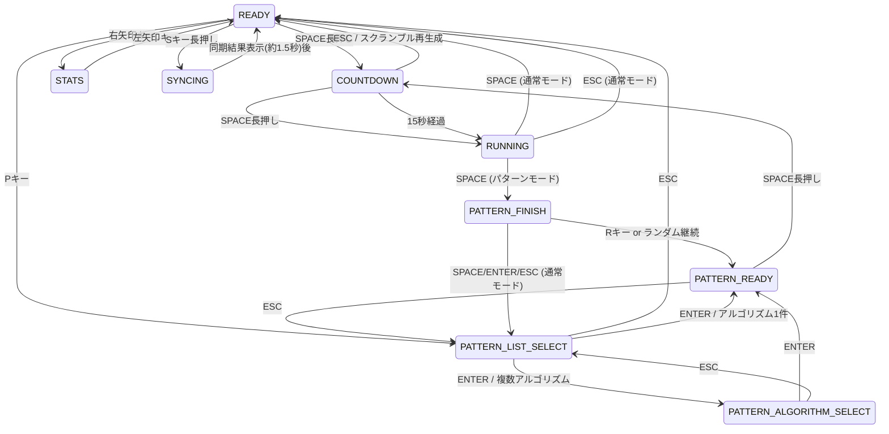

# Speedcube Timer - アーキテクチャドキュメント

このドキュメントでは、Speedcube Timerのシステム構成、設計思想、主要コンポーネントについて説明します。

## 目次
- [システム概要](#システム概要)
- [アーキテクチャ図](#アーキテクチャ図)
- [モジュール構成](#モジュール構成)
- [データベース設計](#データベース設計)
- [状態管理](#状態管理)
- [データフロー](#データフロー)
- [設計原則](#設計原則)

---

## システム概要

### 技術スタック

- **言語**: Python 3.10+
- **GUIフレームワーク**: Pyxel 2.3.18
- **データベース**: SQLite3
- **外部連携**: Google Sheets API（gspread）
- **データ形式**: JSON（マスターデータ）

### 主要機能

1. **基本タイマー機能**
   - WCAルール準拠のインスペクション・タイマー
   - 音声フィードバック
   - スクランブル生成

2. **パターン習得モード**
   - 78パターン（OLL: 57, PLL: 21）の練習
   - 複数アルゴリズム対応
   - ランダム・手動選択モード

3. **統計・記録管理**
   - ローカルDB保存
   - Google Sheets同期
   - AO5/AO12計算

---

## アーキテクチャ図

### システム構成図

```
┌─────────────────────────────────────────────────────────┐
│                     Pyxel GUI Layer                      │
│  (app.py, renderer.py)                                   │
└────────────────────┬────────────────────────────────────┘
                     │
         ┌───────────┴───────────┐
         │                       │
┌────────▼─────────┐    ┌───────▼──────────┐
│  State Machine   │    │  Event Handlers  │
│  (states.py)     │◄───┤(state_handlers.py)│
└────────┬─────────┘    └──────────────────┘
         │
    ┌────┴─────┬──────────┬──────────┬──────────┐
    │          │          │          │          │
┌───▼───┐ ┌───▼───┐ ┌───▼───┐ ┌───▼───┐ ┌───▼────┐
│Stats  │ │Pattern│ │Scramble│ │Log    │ │Constants│
│Module │ │Module │ │Module  │ │Handler│ │        │
└───┬───┘ └───┬───┘ └────────┘ └───┬───┘ └────────┘
    │         │                     │
    └─────────┴─────────────────────┘
                     │
         ┌───────────┴───────────┐
         │                       │
    ┌────▼─────┐         ┌──────▼──────┐
    │ SQLite   │         │ Google      │
    │ Database │         │ Sheets API  │
    └──────────┘         └─────────────┘
```

### レイヤー構造

```
┌─────────────────────────────────┐
│  Presentation Layer             │  UI表示・入力処理
│  (app.py, renderer.py)          │
├─────────────────────────────────┤
│  Application Layer              │  状態管理・ビジネスロジック
│  (states.py, state_handlers.py) │
├─────────────────────────────────┤
│  Domain Layer                   │  ドメインロジック
│  (stats.py, patterns.py,        │
│   scramble.py)                  │
├─────────────────────────────────┤
│  Infrastructure Layer           │  データアクセス・外部連携
│  (log_handler.py)               │
└─────────────────────────────────┘
```

---

## モジュール構成

### 主要モジュールの責務

#### 1. `main.py`
- **責務**: アプリケーションのエントリーポイント
- **機能**: Pyxelアプリケーションの初期化と起動

#### 2. `src/app.py`
- **責務**: メインアプリケーションクラス
- **機能**:
  - 状態管理
  - Pyxelのupdate/drawループ
  - 各種モジュールの統合
- **主要クラス**: `SpeedcubeApp`

#### 3. `src/renderer.py`
- **責務**: 画面描画処理
- **機能**:
  - 状態ごとの画面描画
  - UI要素の描画（テキスト、ボタン、リスト等）
- **主要メソッド**:
  - `draw_ready_state()`: メイン画面
  - `draw_countdown_state()`: インスペクション画面
  - `draw_running_state()`: タイマー実行中
  - `draw_stats_state()`: 統計画面
  - `draw_pattern_*()`: パターンモード各画面

#### 4. `src/states.py`
- **責務**: 状態定義と状態遷移管理
- **機能**:
  - 状態列挙型（TimerState）の定義
  - 状態遷移ルール
- **状態一覧**:
  ```python
  class TimerState(Enum):
    READY = "ready"                          # メイン画面
    COUNTDOWN = "countdown"                  # インスペクション
    RUNNING = "running"                      # タイマー実行中
    SYNCING = "syncing"                      # Google Sheets同期結果表示
    STATS = "stats"                          # 統計画面
    PATTERN_LIST_SELECT = "pattern_list"     # パターン選択
    PATTERN_ALGORITHM_SELECT = "algo_select" # アルゴリズム選択
    PATTERN_READY = "pattern_ready"          # パターン準備
    PATTERN_FINISH = "pattern_finish"        # パターン完了
  ```

#### 5. `src/state_handlers.py`
- **責務**: 各状態での入力処理
- **機能**: 状態ごとのキー入力・イベント処理
- **主要クラス**:
  - `ReadyStateHandler`: メイン画面の入力処理
  - `CountdownStateHandler`: インスペクション中の入力
  - `RunningStateHandler`: タイマー実行中の入力
  - `SyncingStateHandler`: 手動同期の結果表示
  - `StatsStateHandler`: 統計画面と月次統計キャッシュ管理
  - `PatternListSelectHandler`: パターン選択の入力
  - `PatternFinishHandler`: パターン完了の入力

#### 6. `src/stats.py`
- **責務**: 統計計算とデータベースアクセス
- **機能**:
  - タイム統計（ベスト、平均、AO5、AO12）
  - パターン別統計
  - アルゴリズム別統計
  - ユーザー設定管理
  - 月次統計のキャッシュと計算
- **主要メソッド**:
  - `update_stats()`: セッション統計の更新（best_time, worst_time, ao5, ao12など）
  - `calculate_average()`: 直近N回の平均計算
  - `get_monthly_solve_count()`, `get_monthly_average_time()`: 月次統計
  - `get_pattern_times()`, `get_pattern_best()`, `get_pattern_count()`: パターン統計
  - `get_algorithm_times()`, `get_algorithm_best()`, `get_algorithm_count()`: アルゴリズム統計
  - `get_user_selected_algorithm()`, `set_user_selected_algorithm()`: ユーザー設定管理
  - `get_algorithm_rating()`, `set_algorithm_rating()`: アルゴリズム評価管理

#### 7. `src/patterns.py`
- **責務**: パターン・アルゴリズムデータ管理
- **機能**:
  - JSONからのマスターデータ読み込み
  - パターン・アルゴリズム検索
  - ランダム選択（重複回避）
- **主要クラス**:
  - `Pattern`: パターンデータクラス
  - `Algorithm`: アルゴリズムデータクラス
  - `PatternCategory`: カテゴリ列挙型
- **主要メソッド**:
  - `load_patterns()`, `load_algorithms()`: JSON読み込み
  - `get_pattern()`, `get_algorithm()`: データ取得
  - `get_random_pattern()`: ランダム選択

#### 8. `src/scramble.py`
- **責務**: スクランブル生成
- **機能**: ランダムなキューブスクランブルの生成
- **主要メソッド**: `generate_scramble()`

#### 9. `src/log_handler.py`
- **責務**: データ永続化と外部連携
- **機能**:
  - SQLiteデータベースとの接続管理
  - 計測結果の保存
  - Google Sheetsとの双方向同期
  - セッションIDの発行
- **主要メソッド**:
  - `_init_database()`: `speedcube.db`のテーブル初期化
  - `save_result()`: 計測タイムの保存
  - `get_results()`, `get_session_results()`: 記録の取得
  - `sync_data()`: Google Sheetsとの双方向同期

#### 10. `src/constants.py`
- **責務**: アプリケーション定数の定義
- **機能**: 画面サイズ、色、キー定義等の定数管理

---

## データベース設計

### ER図

```
┌────────────┐
│  results   │
├────────────┤
│ id (PK)    │
│ datetime   │
│ time_result│
│ scramble   │
│ session    │
└────────────┘

┌──────────────────────┐
│   pattern_solves     │
├──────────────────────┤
│ id (PK)              │
│ pattern_id           │
│ pattern_name         │
│ pattern_category     │
│ solve_time           │
│ timestamp            │
│ session_id           │
│ practice_mode        │
│ set_id               │
│ algorithm_id         │
└──────────────────────┘

┌──────────────────────────┐
│ user_pattern_preferences │
├──────────────────────────┤
│ pattern_id (PK)          │
│ selected_algorithm_id    │
│ last_updated             │
└──────────────────────────┘

┌────────────────────────┐
│ user_algorithm_ratings │
├────────────────────────┤
│ algorithm_id (PK)      │
│ rating                 │
│ notes                  │
│ last_updated           │
└────────────────────────┘
```

### データベースファイル

- 既定パス: `data/speedcube.db`
- `config.ini` の `[Database]` セクション `db_path` で保存先を変更可能

### テーブル詳細

#### `results`
通常タイマーの記録

| カラム | 型 | 説明 |
|--------|---|------|
| id | INTEGER (PK) | 自動採番ID |
| datetime | TEXT | 記録日時（`YYYY/MM/DD HH:MM:SS`） |
| time_result | REAL | タイム（秒、小数2桁） |
| scramble | TEXT | スクランブル文字列 |
| session | TEXT | セッションID（起動ごとに生成） |

#### `pattern_solves`
パターン習得モードの記録

| カラム | 型 | 説明 |
|--------|---|------|
| id | INTEGER (PK) | 自動採番ID |
| pattern_id | TEXT | パターンID（例: `OLL_01`） |
| pattern_name | TEXT | パターン名 |
| pattern_category | TEXT | カテゴリ（`OLL`/`PLL`） |
| solve_time | REAL | タイム（秒） |
| timestamp | DATETIME | 記録時刻（デフォルト現在時刻） |
| session_id | TEXT | セッションID |
| practice_mode | TEXT | 練習モード（`manual`/`random`等） |
| set_id | TEXT | プリセット・カスタムセットID（将来拡張用） |
| algorithm_id | TEXT | 使用アルゴリズムID |

**インデックス**:
- `idx_pattern_solves_pattern_id` on `pattern_id`
- `idx_pattern_solves_category` on `pattern_category`
- `idx_pattern_solves_timestamp` on `timestamp`

#### `user_pattern_preferences`
ユーザーのパターンごとのデフォルトアルゴリズム設定

| カラム | 型 | 説明 |
|--------|---|------|
| pattern_id | TEXT (PK) | パターンID |
| selected_algorithm_id | TEXT | 選択されたアルゴリズムID |
| last_updated | DATETIME | 更新日時 |

#### `user_algorithm_ratings`
アルゴリズムの評価

| カラム | 型 | 説明 |
|--------|---|------|
| algorithm_id | TEXT (PK) | アルゴリズムID |
| rating | INTEGER | 評価（1-5、CHECK制約あり） |
| notes | TEXT | メモ（任意） |
| last_updated | DATETIME | 更新日時 |

---

## 状態管理

### 状態遷移図



### 状態遷移ルール

| 現在の状態 | イベント | 次の状態 | 条件 |
|-----------|---------|---------|------|
| READY | SPACE (長押し) | COUNTDOWN | - |
| READY | P | PATTERN_LIST_SELECT | - |
| READY | 右矢印キー | STATS | - |
| READY | S (長押し) | SYNCING | 約1秒ホールドで同期開始 |
| READY | Q | アプリ終了 | 同期結果をログに表示して終了 |
| COUNTDOWN | SPACE (長押し) | RUNNING | - |
| COUNTDOWN | 15秒経過 | RUNNING | インスペクションタイムアウト |
| COUNTDOWN | ESC | READY | スクランブル再生成 |
| RUNNING | SPACE | READY | 通常モード：記録保存後スクランブル再生成 |
| RUNNING | SPACE | PATTERN_FINISH | パターンモード：結果画面へ |
| RUNNING | ESC | READY | 通常モードのキャンセル |
| RUNNING | ESC | PATTERN_READY | パターンモードのキャンセル |
| STATS | 左矢印キー | READY | 月次統計キャッシュを破棄 |
| SYNCING | 自動 | READY | 同期結果表示後、約1.5秒で戻る |
| PATTERN_LIST_SELECT | ENTER | PATTERN_READY | 選択したパターンのデフォルトアルゴリズム使用 |
| PATTERN_LIST_SELECT | ENTER | PATTERN_ALGORITHM_SELECT | 複数アルゴリズムから選択 |
| PATTERN_LIST_SELECT | ESC | READY | - |
| PATTERN_ALGORITHM_SELECT | ENTER | PATTERN_READY | 選択したアルゴリズムを保存 |
| PATTERN_ALGORITHM_SELECT | ESC | PATTERN_LIST_SELECT | - |
| PATTERN_READY | SPACE (長押し) | RUNNING | - |
| PATTERN_READY | ESC | PATTERN_LIST_SELECT | - |
| PATTERN_FINISH | SPACE/ENTER | PATTERN_LIST_SELECT | 通常モード：評価保存後一覧へ |
| PATTERN_FINISH | SPACE/ENTER | PATTERN_READY | ランダムモード継続 |
| PATTERN_FINISH | R | PATTERN_READY | 同パターン再挑戦 |
| PATTERN_FINISH | ESC | PATTERN_LIST_SELECT | ランダムモード解除 |

---

## データフロー

### タイム記録フロー

```
[ユーザー操作]
  │ SPACE押下
  ▼
[RunningStateHandler]
  │ タイマー停止
  │ タイム計算
  ▼
[SpeedcubeLogger.save_result()]
  │ セッションIDを付与
  │ スクランブルと共に保存
  ▼
[SQLite Database]
  │ resultsテーブルに挿入
  ▼
[SpeedcubeStats.update_stats()]
  │ セッション結果を再読込
  │ ベスト/平均/AO5/AO12を更新
  │ 月次統計キャッシュを無効化
  ▼
[Renderer.draw_ready_state()]
  │ READY画面を再描画
```

### パターン練習フロー

```
[パターン選択]
    │
    ▼
[PatternListSelectHandler]
    │ パターン決定
    │ ユーザー設定読み込み
    ▼
[Pattern/Algorithm取得]
    │ patterns.py
    │ stats.py
    ▼
[PATTERN_READY状態]
    │ 情報表示
    │ SPACE長押し待ち
    ▼
[タイマー実行]
    │ COUNTDOWN → RUNNING
    ▼
[タイマー完了]
  │ SpeedcubeLogger.cursorを使用
  │ pattern_solvesにINSERT
  ▼
[PATTERN_FINISH状態]
  │ タイム表示
  │ 評価入力
  ▼
[ユーザー設定更新]
  │ 評価保存（user_algorithm_ratings）
  │ 選択アルゴリズム保存（user_pattern_preferences）
```

### Google Sheets同期フロー

```
[READY状態でSキー長押し]
  │ またはQキーで終了
  ▼
[SpeedcubeLogger.sync_data()]
  │ credentials読み込み
  │ 認証
  ▼
[データセット取得]
  │ resultsテーブル全件
  │ Spreadsheet全行（ヘッダー除外）
  ▼
[差分算出]
  │ Spreadsheet→SQLiteの不足分をINSERT
  │ SQLite→Spreadsheetの不足分をappend_rows
  ▼
[同期結果]
  │ imported / uploaded件数を返却
  │ SYNCING状態で約1.5秒表示
  ▼
[完了]
  │ READYに復帰 or アプリ終了
```

---

## 設計原則

### 1. 単一責任の原則（SRP）
各モジュールは1つの責務のみを持つ
- `renderer.py`: 描画のみ
- `stats.py`: 統計とDB操作のみ
- `state_handlers.py`: 入力処理のみ

### 2. 状態パターン
状態ごとに処理を分離し、状態遷移を明確化
- 状態列挙型で管理
- 状態ごとのハンドラークラス
- 明示的な状態遷移

### 3. データ駆動設計
マスターデータはJSONで管理
- `data/patterns.json`: パターン定義
- `data/algorithms.json`: アルゴリズム定義
- コード変更なしでデータ追加可能

### 4. 疎結合
モジュール間の依存を最小化
- インターフェース経由のアクセス
- 必要最小限の情報のみ渡す

### 5. テスタビリティ
テストしやすい構造
- 純粋関数の使用
- モックしやすいDB接続
- 単体テスト可能な粒度

---

## パフォーマンス考慮事項

### データベース
- インデックスの適切な配置
- トランザクションの適切な使用
- バッチ処理の活用

### 描画
- 必要な部分のみ再描画
- 重い処理はキャッシュ

### メモリ
- 不要なデータは適時解放
- 大量データはページング

---

## セキュリティ
- API認証情報は`.gitignore`で除外
- データベースはローカルのみ
- 外部入力のバリデーション

---

## 今後の拡張性

### Phase 4-6への準備
- `PatternSet`クラスの追加余地
- 統計画面のタブ切り替え対応
- プラグイン機構の検討

詳細は [開発ロードマップ](roadmap.md) を参照してください。
