# Speedcube Timer フロー図

このドキュメントでは、Speedcube Timerの画面遷移とフローをMermaid図で示します。

## 目次
- [現在の実装状態（Phase 1-3完了）](#現在の実装状態phase-1-3完了)
- [通常タイマーモード](#通常タイマーモード)
- [パターン練習モード - 手動選択](#パターン練習モード---手動選択)
- [パターン練習モード - ランダム](#パターン練習モード---ランダム)
- [将来の計画（Phase 4-6）](#将来の計画phase-4-6)

---

## 現在の実装状態（Phase 1-3完了）

### 全体の状態遷移

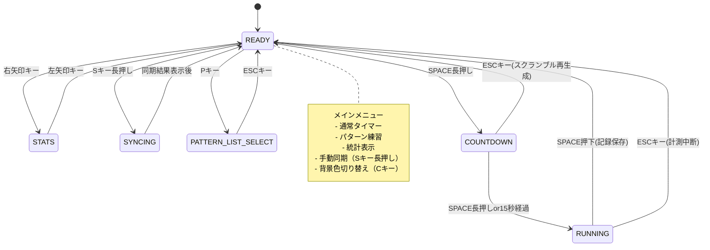

---

## 通常タイマーモード

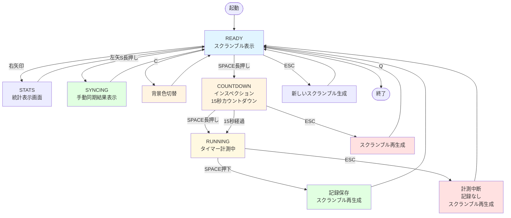

---

## パターン練習モード - 手動選択

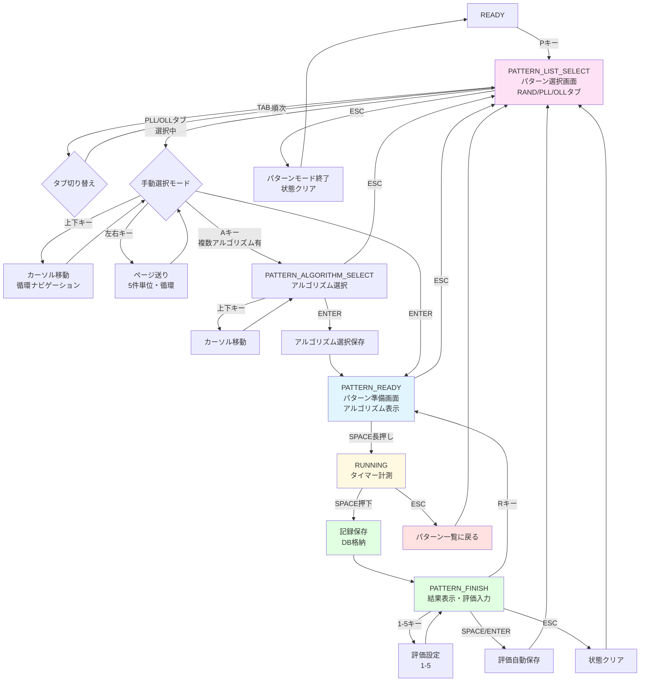

---

## パターン練習モード - ランダム

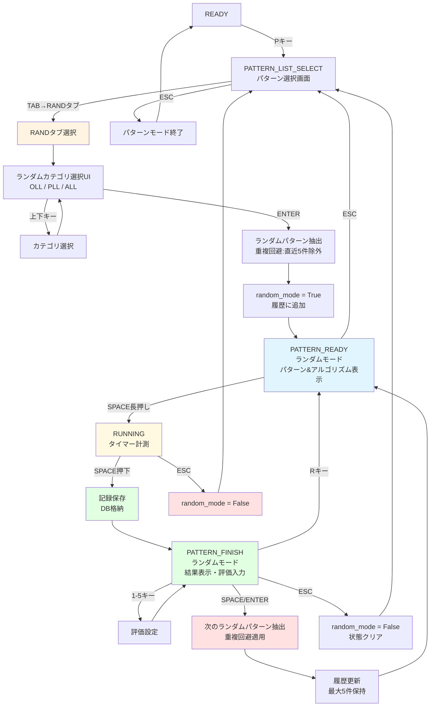

### ランダムモードの重複回避ロジック

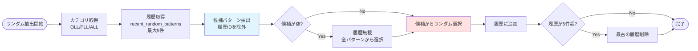

---

## 将来の計画（Phase 4-6）

### Phase 4: プリセット連続実行モード（未実装）

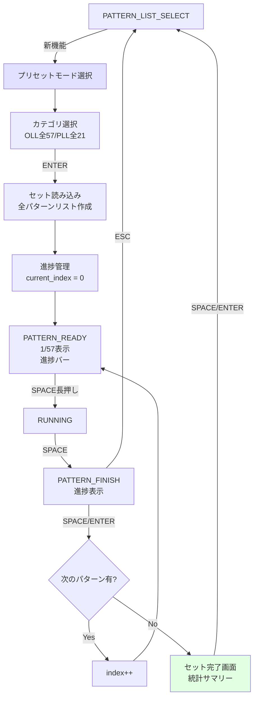

### Phase 5: カスタムセット機能（未実装）

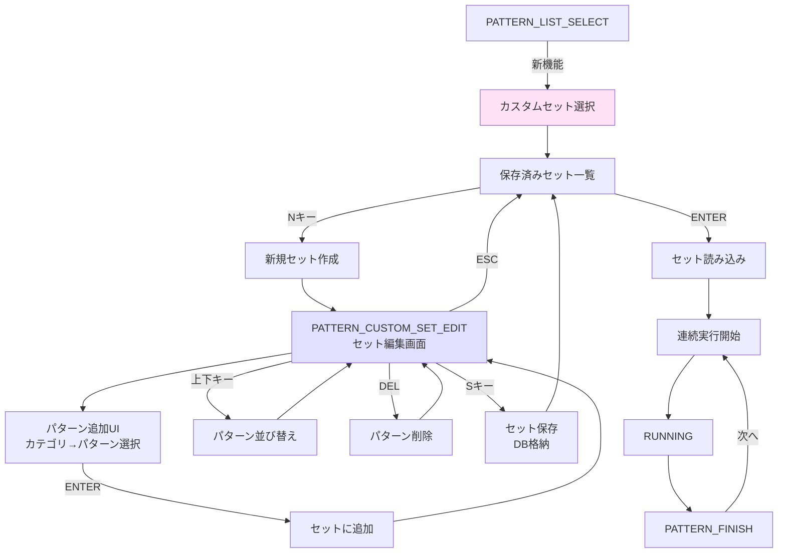

### Phase 6: 統計画面拡張（未実装）

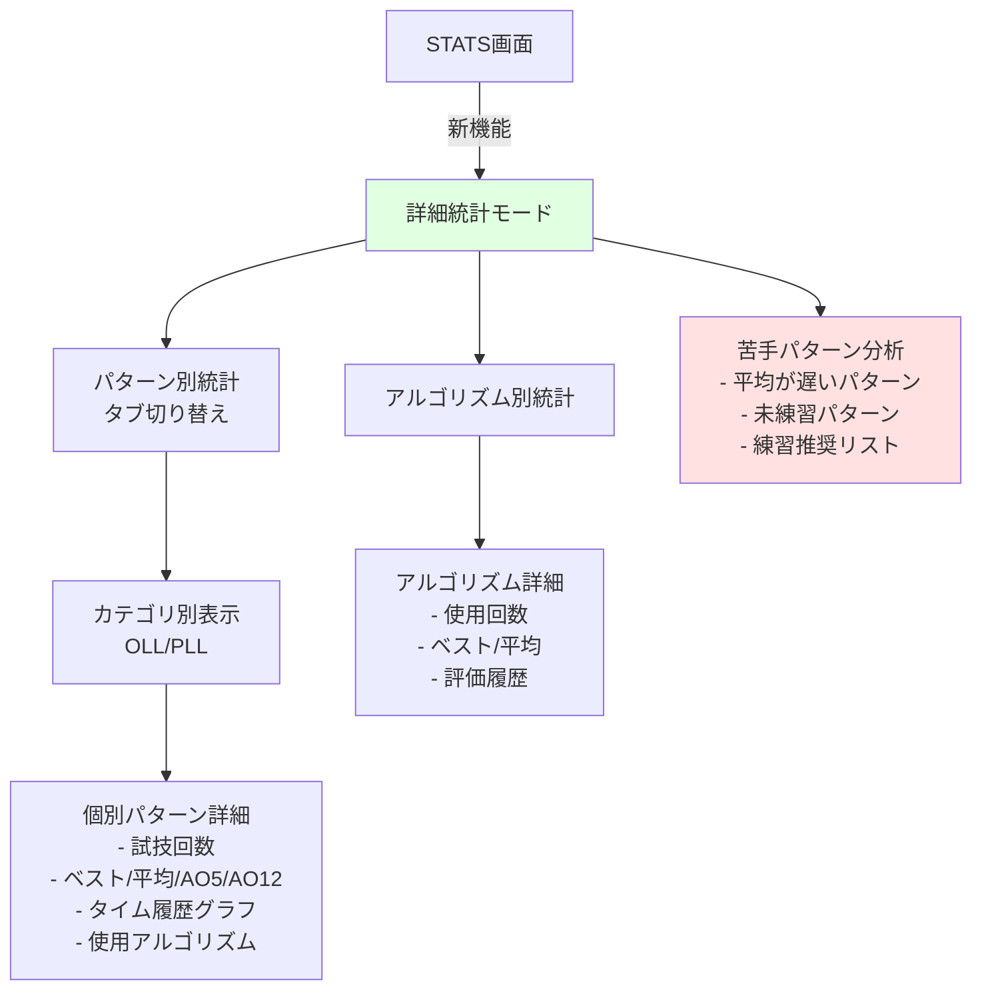

---

## データフロー

### パターン解法記録のデータフロー

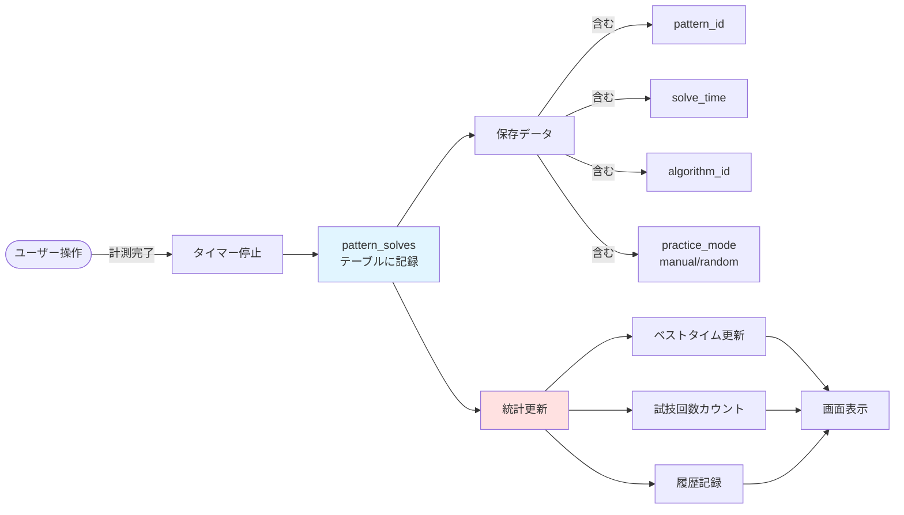

### ユーザー設定のデータフロー

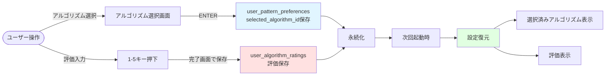

---

## 凡例

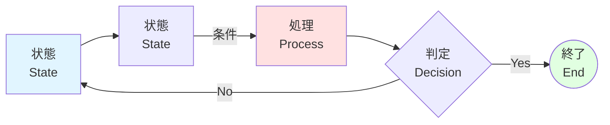

- 青色: 状態（State）
- 赤色: 処理・アクション
- 緑色: 完了・終了状態
- 紫色: 特別な状態（編集モードなど）
